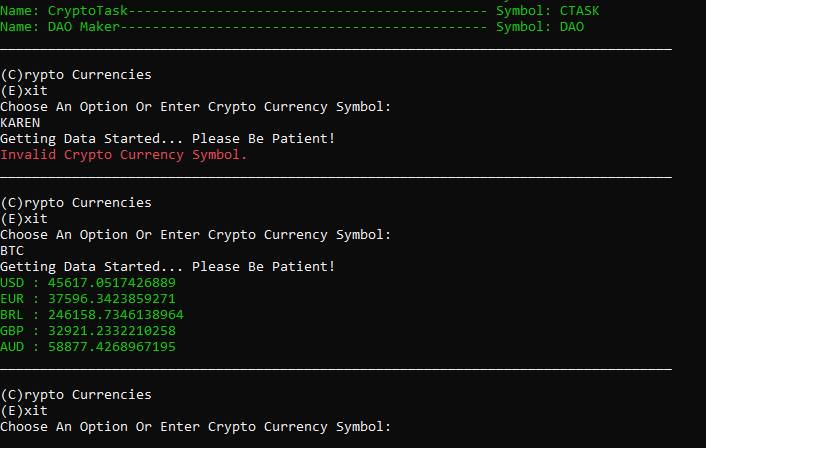
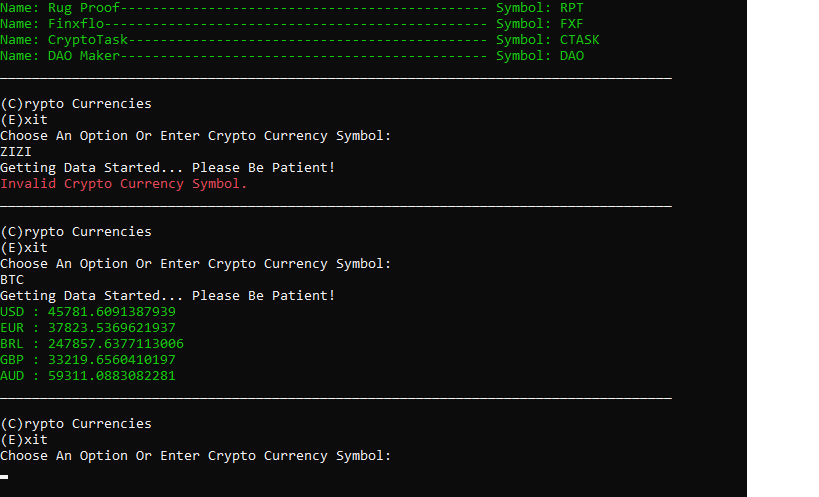
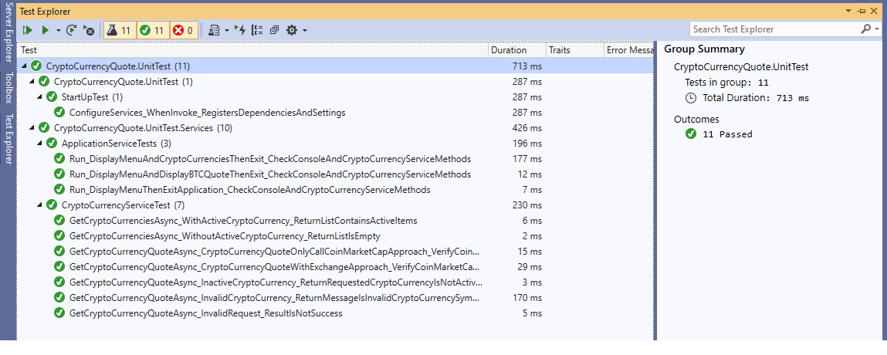

# CryptoCurrencyQuote

> A simple console application to output the list of the latest quotes in a user submitted cryptocurrency code (e.g. BTC)

- [Crypto Currency Quote](#CryptoCurrencyQuote)
  - [Prerequisites](#prerequisites)
  - [Build with](#build-with)
  - [Considerations](#considerations)
  - [Settings](#settings)
  - [Running the app with direct approach](#running-the-app-with-direct-approach)
  - [Running the app with exchange approach](#running-the-app-with-exchange-approach)
  - [Running the unit tests](#running-the-unit-tests)
## Prerequisites

To Build this application you need the following:

- [.Net Core 3.1.3](https://dotnet.microsoft.com/download/dotnet-core/3.1#sdk-3.1.201/).

To review the code you need the following:

- [Visual Studio 2019 (Latest version)](https://visualstudio.microsoft.com/) installed on your development machine. If you do not have Visual Studio, visit the previous link for download options. (**Note:** This tutorial was written with Visual Studio version 16.5. The steps in this guide may work with other versions, but that has not been tested.)

## Build with
- [.Net Core 3.1.3](https://dotnet.microsoft.com/download/dotnet-core/3.1#sdk-3.1.201/).
- [.Moq](https://github.com/moq/moq) Mocking the objects in unit tests.

## Considerations
-There is two approaches for calucationg quote. 
	- Per target currency call CoinMarketCap API.
	- Get submitted srypto currency quote in base currency by call coin market api, then get base currency rate to target currencies by call ExchangeRates Api, At last calculate Quotes.
- This could be changed in appsetting.json file.
- I prefer second approach.

## Settings
- CoinMarketCap API base URL and Key are specified in appsettings.json file and is easily changable and configurble for CI/CD pipe line.
- ExchangeRates API base URL as well is specified in appsettings.json file.
- Currencies To Quote are specified in appsettings.json file the Currencies section. (eg USD, EUR,...).
- Calculate Approach could be changed in appsetting.json the CalculateQuoteApproach section.
	- To use first approach set value to onlycallcoinmarketcap.
	- For  second approach other value.
- Base Currency To Quote in Crypto Currency Quote With Exchange Approach could change in appsettings.json file the BaseCurrency section. (eg USD, EUR,...).
- Maximum Floating Point Digit to display quote to user is located in appsettings.json.

- There is loggin setting as well which could be change by environment.

## Running the app with direct approach

To run the app, follow the steps.

1 - Open Command Prompt and change the path to [application execution folder](./CryptoCurrencyQuote/CryptoCurrencyQuote-Demo-DirectApproach) 

2 - Run the application by the following command

```
Examples:

C:\CryptoCurrencyQuote-Demo-DirectApproach> CryptoCurrencyQuote.exe
```
[]()

The easy way:

Just run "Publish And Run_Direct Approach.bat" file.


## Running the app with exchange approach

To run the app, follow the steps.

1 - Open Command Prompt and change the path to [application execution folder](./CryptoCurrencyQuote/CryptoCurrencyQuote-Demo-ExchangeApproach)

2 - Run the application by the following command

```
Example:

C:\CryptoCurrencyQuote-Demo-ExchangeApproach> CryptoCurrencyQuote.exe
```
[]()

The easy way:

Just run "Publish And Run_Exchange Approach.bat" file.

## Running the unit tests

Go to the test explorer window in Visual Studio and push the run button.

[]()